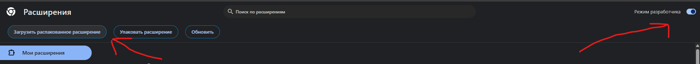

# JSON formatter in modal

Данное расширение позволит форматировать JSON в браузере, в модальном окне (не переходя на другую страницу)

Данное расширение не моё. Оно было взято с сайта: 'https://json-formatter-in-modal.en.softonic.com/chrome/extension и модифицированно.

Chrome отключил данное расширение в своём магазине из-за прекращения поддержки старых версии своих библиотек.

Я обновил данное расширение до поддерживаемой Chrome версии и внёс небольшие доработки.

## Что было сделано:
- Обновлён manifest.json до новой (3), актуально версии.
- Добавлена тёмная тема.
- Добавлена кнопка для быстрого копирования JSON.

## Как установить расширение?
1. Скачиваем данный репозиторий и разархивируем его.
2. Переходим в настройки расширений Google Chrome и включаем там галочку "**Режим разработчика**"
3. После чего у вас появится кнопка "**Загрузить распакованное расширение**" 
4. Нажимаем на кнопку "**Загрузить распакованное расширение**" и выбираем папку с расширением
5. После чего в списке ваших расширений появится новое расширение "**JSON Formatter In Modal**"

## Как пользоваться?
1. Выделяем правой кнопкой мыши любой JSON, жмём правой кнопкой мыши по выделенном тексту и нажимаем на кнопку "**JSON Formatter In Modal**" 
2. После чего у вас откроется модальное окно с форматированным JSON 